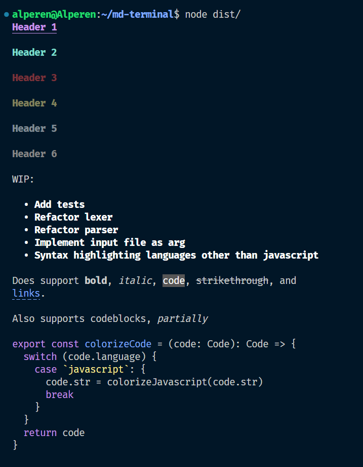

# Header 1

## Header 2

### Header 3

#### Header 4

##### Header 5

###### Header 6

WIP:

- Add tests
- Refactor lexer
- Refactor parser
- Implement input file as arg
- Syntax highlighting languages other than javascript

Does support **bold**, _italic_, `code`, ~~strikethrough~~, and
[links](https://www.youtube.com/watch?v=dQw4w9WgXcQ).

Also supports codeblocks, _partially_

```javascript
export const colorizeCode = (code: Code): Code => {
  switch (code.language) {
    case `javascript`: {
      code.str = colorizeJavascript(code.str)
      break
    }
  }
  return code
}
```

## Example output:


